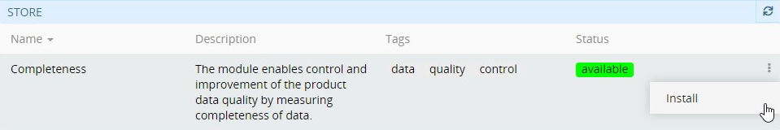
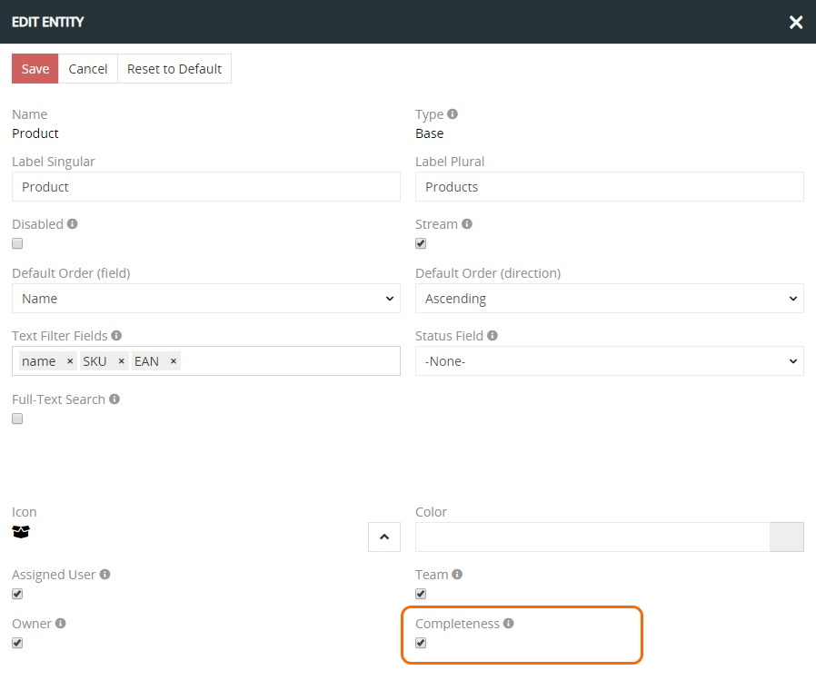
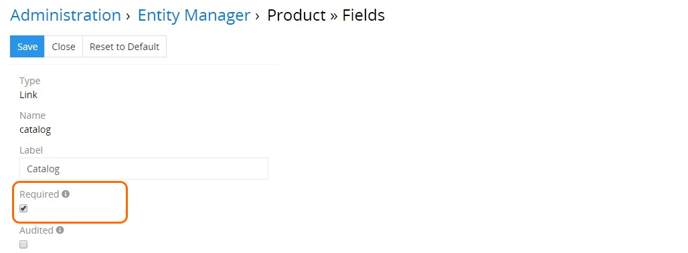
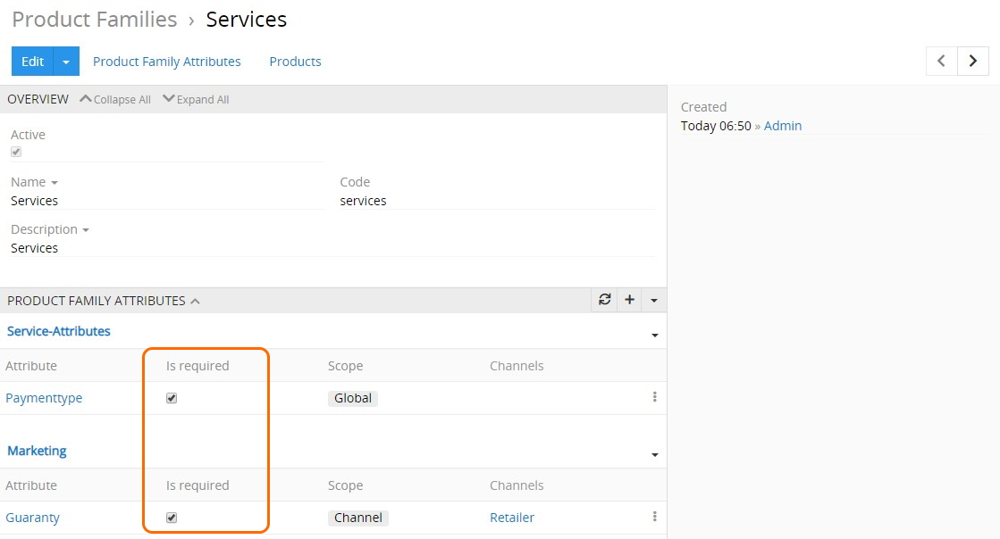

# Completeness

The "Completeness" module measures in percentage the completeness level of the required fields that allows you to control and improve the entity records data quality. In addition, it enables saving entity records, in which required fields are left empty. Please, consider that without the "Completeness" module installed and activated in your system, saving records without filling in all the required fields is not possible.

Thanks to the [graphical representation](#completeness-dashlets), you have full control over the completeness of your entity records data in the system.

## Installation 

To install the "Completeness" module to your system, go to `Administration > Module Manager`, find this module in the "Store" list and click `Install`: 

Select the desired version in the installation pop-up window that appears and click the `Install` button. The module background will turn green and it will be moved to the "Installed" section of the Module Manager. Click `Run update` to confirm its installation.

Please, note that running the system update will lead to the logout of all users.

To update/remove the "Completeness" module from the system, use the corresponding options from its single record actions menu in `Administration > Module Manager`. 

## Administrator Functions

The "Completeness" module was created primarily to be used together with the [TreoPIM](https://treopim.com/help/what-is-treopim) system, so further description of the module is given in the context of TreoPIM.

### Module Activation 

To activate the completeness mechanism for a certain entity, go to `Administration > Entity Manager`, select the desired entity (e.g. Product) and click `Edit`:

In the editing pop-up that opens, select the "Complete" checkbox and click the `Save` button to apply the changes:

Please, note that you can activate the completeness mechanism for as many entities as needed in the same way.

### Marking Fields and Attributes as Required  

The concept of completeness is applied only to the required fields. To mark the *field* as required, go to `Administration > Entity Manager` and click `Fields` for the desired entity:

In the new window that opens, all fields of the selected entity are displayed. Select the desired field or create a new one that must be completed and select the `Required` checkbox:

You can also define the  product *attributes* as required, both of the `Global` and `Channel` scope. This is performed on the product family detail view page:

Linking `Channel` attributes to the products allows you to have *channel completeness* calculated in addition to the overall completeness. However, if there are no required attributes linked to the given channel, the completeness is calculated on the basis of the required `Global` attributes values.

Refer to the **TreoPIM user guide** to learn more about the [attributes](https://treopim.com/help/attributes), [channels](https://treopim.com/help/channels), and [product families](https://treopim.com/help/product-families).

### Сompleteness Value Display Configuration

To add the completeness level display for the previously configured entity, go to `Administration > Layout Manager` and click the given entity in the list to unfold the list of layouts available for this entity. Click the layout you wish to configure (e.g. `List`) and enable the `Complete` field by its drag-and-drop from the right column to the left:

Please, note that overall completeness is calculated for the data fields of the default language. However, if you wish to have your field data in multiple languages with the ability to calculate and display their completeness level, you can install the [**Multi-Languages**](https://treopim.com/store/multi-languages) module to your system and configure it properly, and then [add](#marking-fields-and-attributes-as-required) the `Complete (<Local>)` (e.g. `Сomplete (EnUs)`, `Сomplete (DeDe)`, etc.) fields for the desired entities in the same way, as described above.

Click the `Save` button to complete the operation. The added `Complete` field will be displayed on the configured layout type for the given entity:

When the entity record with enabled completeness is edited (e.g. required fields are added, removed, etc.), the completeness percentage is recalculated on the fly.

Please, note that you cannot activate the product (i.e. set the `Active` checkbox) if its overall completeness is not 100%:

## User Functions 

After the "Completeness" module is installed and configured by the administrator, user can view the completeness levels of entity records that are predefined by the administrator and sort the records in this column accordingly:

Also user can influence the completeness statistics by editing the required fields and attributes of the configured entities according to his access rights.

### Completeness Calculation Logic

TreoPIM supports three types of entity record data calculation for completeness, in percentage:

- **Overall** – the completeness level of the required fields and required `Global` attributes;
- **Channel** – the completeness level of the required fields and required `Channel` attributes. If required `Channel` attribute values are not available, the completeness is calculated on the basis of the required `Global` attributes values.
- **Locale** – the completeness level of the required multi-language fields and required multi-language `Global` attributes (`Array MultiLang`, `Enum MultiLang`, `Multi-Enum MultiLang`, `Text MultiLang`, `Varchar MultiLang`, and `Wysiwyg MultiLang`). Refer to the [**Multi-languages**](https://treopim.com/store/multi-languages) module description for details.

### Completeness Dashlets  

In order to conveniently track the completeness of product information in the system, user can display special dashlets on his custom dashboard:

The following dashlets are available for display:
- **Completeness overview** – overall completeness values, including configured locales and channels, in the table view. 
- **Locale completeness** – completeness by locales separately and total, in the graphic form.
- **Channel completeness** – completeness by channels separately and total, in the graphic form.

To learn more about dashboards and dashlets, refer to the corresponding [article](https://treopim.com/help/user-interface) in the TreoPIP user guide.

***Get the "Completeness" module now to easily control and greatly improve the quality of your product data!***

